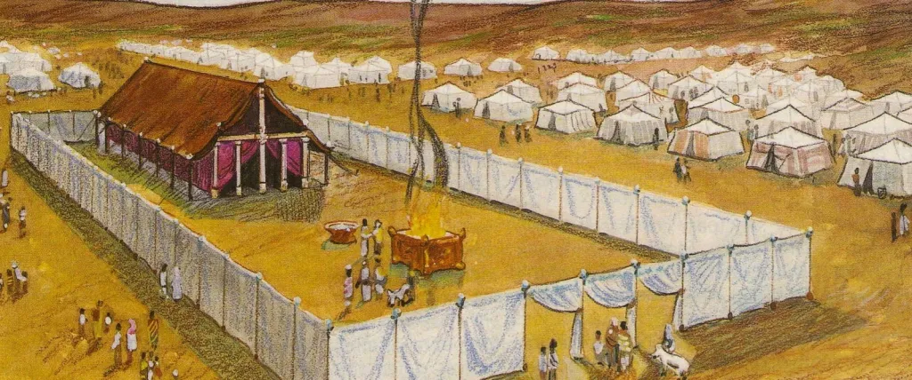

<b>The Jerusalem Temple in the Hebrew Bible</b>

In the Hebrew Bible, God accompanies the people of Israel in a tangible way beginning with their escape from Egypt. In the wilderness, God is visible as a pillar of smoke by day, and a pilar of fire by night. Then, when Moses receives the Law at Mount Sinai, God provides instructions for the people to build a tabernacle – a movable tent – where God would dwell among the people (see Exodus 25-40).

Many generations later, King David established Israel as a sovereign kingdom with Jerusalem as its capital. After building his own house (i.e., royal palace), David famously proposed to build a house for God. Through the prophet Nathan, God rejects David’s initiative. Instead, God determines that David’s son Solomon will be the one to build a temple. The construction of the Jerusalem Temple begins in the fourth year of Solomon’s reign (c. 967 BCE) and takes about 10 years to complete (see 1 Kings 5:15-9:9).    
The site of the temple within Jerusalem is on the upper regions of an elevation known as Mount Moriah (or sometimes Mount Zion), with the temple occupying a leveled space on the mountain known as the “Temple Mount.” Tradition associates the top of Mount Moriah with several central events in Jewish history, including where Noah’s Ark came to rest as the floods receded and where Abraham almost sacrificed his son Isaac.  

Solomon’s temple becomes the center of Jewish ritual practice until it is destroyed during the Babylonian siege of Jerusalem c. 587 B.C.E., after which much of the surviving population was taken into exile in Babylon. Approximately 50 years later (c. 538 B.C.E.), Persia defeated Babylon and allowed the exiles to return to Jerusalem. It was another 20 years before construction could be completed. Solomon’s Temple therefore comes to be known as the First Temple, and the reconstruction is known as the Second Temple. The Books of Ezra and Nehemiah record the returnees’ efforts to rebuild the temple.

 While they followed the construction guidelines laid out in scripture, they had limited resources and could not make a temple as magnificent as the one that had been destroyed. More significantly, a few important items like the Ark of the Covenant were never recovered once Babylon claimed them.  However, this period also saw significant development of the Temple Mount, including a garrison and lockable gates to the Temple precincts.  

