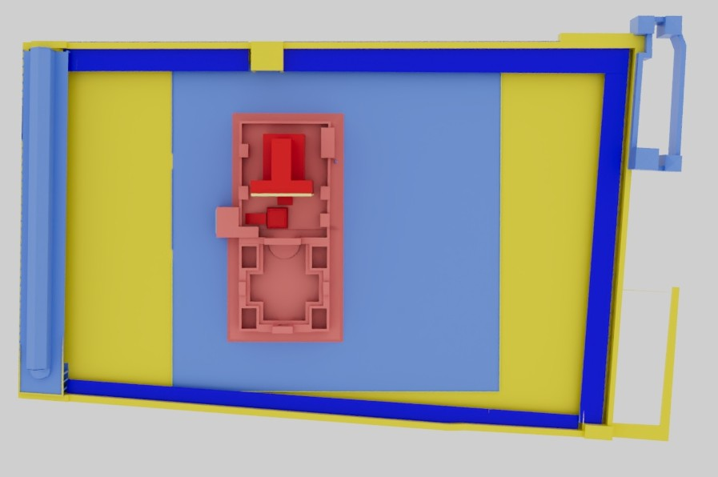
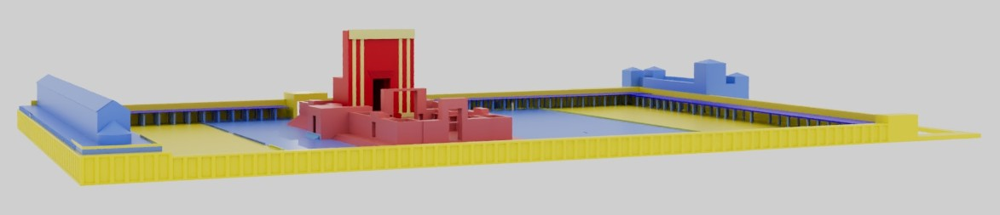

# Primary Sources for Reconstructing the Herodian Temple

While the Temple Mount still exists, the Temple was completely destroyed in 70 C.E. Since that time, other sacred monuments have been built where the Temple once stood, preventing any archaeological excavations from taking place on the Mount itself. Under such conditions, how does a scholar even begin to reconstruct the Herodian Temple? 

 Three major primary sources contribute to our current knowledge about the Second Temple in the first century C.E. The images on this page identify which primary source is most relevant for each structure on the Temple Mount. Shading is used to illustrate the strength of available data, with darker shades representing greater certainty within extant documents.   

| Scriptural Sources (RED) | Flavius Josephus (BLUE) | Archaeological Findings (YELLOW) |
| --------------- | --------------- | --------------- |
| In the Hebrew Bible, God provides detailed instructions and measurements for building the Tabernacle and, centuries later, the first Temple constructed during the reign of King Solomon. Later, following the Babylonia exile, the Books of Ezra and Nehemiah describe efforts to rebuild the Temple (efforts that resulted in the initial Second Temple). Each time the Temple was rebuilt, it retained the same footprint and basic structure. It comes as no surprise, then, that a book or “tractate” in the Mishnah is dedicated to recording precise measurements for every aspect of the Temple (the word <i>Middot</i> means measurements).  | Josephus was a Jewish historian from a priestly family (meaning that he most likely served periodically as a Temple priest in the years before the Jewish-Roman Wars). He fought during the wars, but was forced to surrender to Rome and eventually chose to become a Roman citizen. Josephus accompanied the Roman army during its final campaign against Jerusalem, where he witnessed the fall of the city and the destruction of the Temple. He describes the Temple in two of his major written works:  <i>The Jewish War</i> 5.184-247, and <i>Jewish Antiquities</i> 15.380-425. | Unlike many important locations from antiquity, archaeological information about the Temple is quite limited. The two main reasons for such limited data are that (1) the Second Temple was completely destroyed by the Romans in 70 C.E., with the intention of preventing any future reclamation of the site on the part of the Jewish people; and (2) the establishment of subsequent holy sites on the Temple Mount have made it impossible to excavate the proposed sites of the Temple proper. However, the same holy sites that make it impossible to excavate have also contributed to maintaining the Temple Mount across two millennia.  |
| Mishnah Tractate <i>Middot</i> was written c. 500 C.E., distancing it from the period when the Temple still existed. Consequently, some scholars question whether its measurements reflect the actual Temple or an idealized version such as the Messianic Temple that, according to Jewish teachings, will be established on the Temple Mount once the Messiah comes (Jewish tradition generally considers Jesus a prophet rather than the Messiah). Other interpreters assume that Ezekiel’s vision of a temple (Ezekril chs. 40-47) reflects the Messianic Temple, while <i>Middot</i> describes the features of the Second Temple as it actually existed.  | These descriptions are the only known descriptions from the time when the Second Temple actually existed, and include information about each of the temple courts, including both the inner temple and the Temple Mount. His writings are particularly valuable in describing areas outside of the sacred inner precincts described by Middot. However, Josephus does not detail every aspect of the Temple complex. Furthermore, when comparing his two works that describe the Temple, the details are not always consistent.  | Furthermore, even though excavations cannot be conducted on the Temple Mount, various archaeologists have been able to conduct surveys and excavations of the area around the Temple Mount. Archaeological work in the 19th century proved especially fruitful, including a complete survey of the city, as well as excavations around the outer walls of the Temple Mount that identified several gates, arches for stairways and elevated paths into the Temple Complex. In the 20th century, excavations around the base of the Temple Mount uncovered stone remains of the Temple still showing burn marks from the Roman destruction of 70 C.E. |
| <i>Middot</i> focuses only on the areas of the Temple Mount considered sacred – in other words, the Inner Temple courts that made up the Courts of the jews, (Jewish) Women, Israelites, and Priests. The outermost court in this area has garnered the most debate among scholars. According to <i>Middot</i>, this court was 500 cubits square, which may represent the entire area of an earlier Temple Mount (e.g., the early or Hasmonean Second Temple). In the Herodian Temple Mount, this area was separated from the wider expanse of the Mount by a fence (soreg) with signs warning that any Gentiles who passed beyond the fence could be subject to death. | The passage of time may be one reason for such inconsistencies: Josephus wrote <i>The Jewish War</i> around 75 C.E., soon after the events it describes, while <i> Jewish Antiquities</i> only came out around 94 C.E. Finally, in evaluating the accuracy of Josephus’s descriptions of the Temple, scholars draw attention to the style and purpose of his writing. Specifically, apologetics on behalf of Jews and Judaism appears to be at least one motive for his writing. Consequently, some degree of literary exaggeration might shape Josephus's descriptions of the Temple. | They also found stones with inscriptions associated with the soreg mentioned above, and from an alcove atop Herod’s Royal Stoa where trumpets announced the beginning and end of each Sabbath. Some evidence has even been found to confirm the existence and dimensions of portions of the colonnade that scholars believe occupied the interior circumference of the Temple Mount. At least one column has been found, along with walls showing clear indentations that would have anchored the crossbar for the ceiling of a colonnade. Other archaeological findings are less clear. For example, coins associated with the Temple depict the sanctuary as a building with double columns on each side; while many infer that the coins represent the Temple façade, no definitive evidence about the façade remains.  |
| Above all, particularly through its inattention to features of the Temple Mount that did not fall within the sacred precinct of the 500 square cubit area, <i>Middot</i> draws a distinction between the sacred and secular. The image below illustrates those areas of the Herodian Temple Complex that Middot describes in shades of red. The emphasis on the inner courts and exclusion of the outer courts is plain to see.  | | Some studies have even used imaging technologies to examine the substructure underneath the surface of the Temple Mount. Among the most important features of the substructure are cisterns and drains that allowed for cleansing rituals, the cleaning of the altar, and other crucial aspects of Jewish cultic praxis. The layout of the cisterns and drains continues to be one of the factors scholars consider when proposing theories about the original layout of the Temple Mount. |

